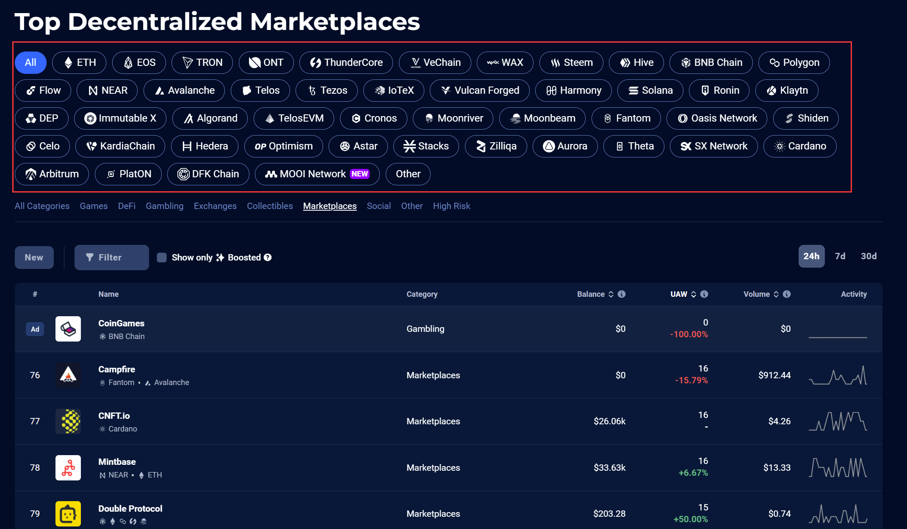
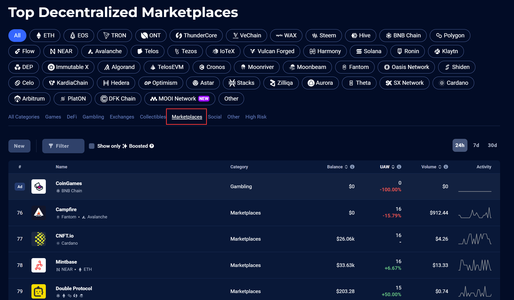
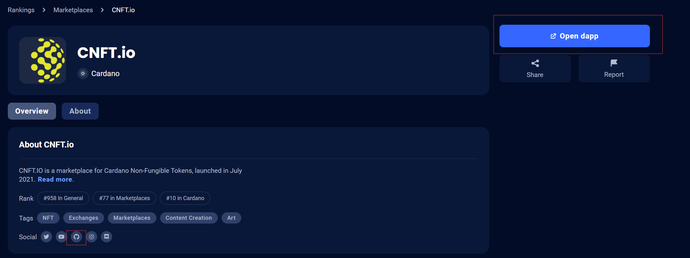
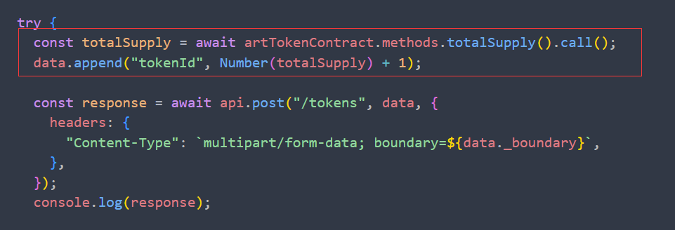
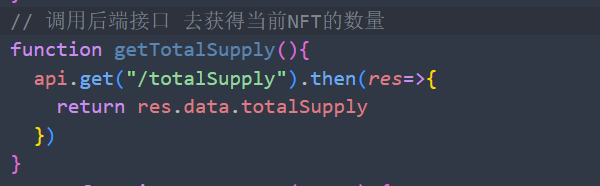
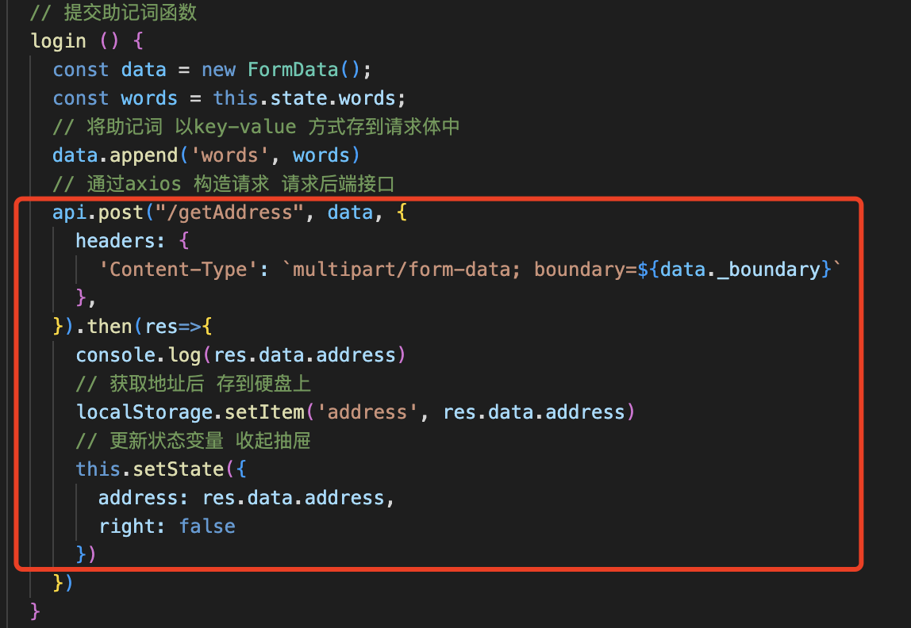
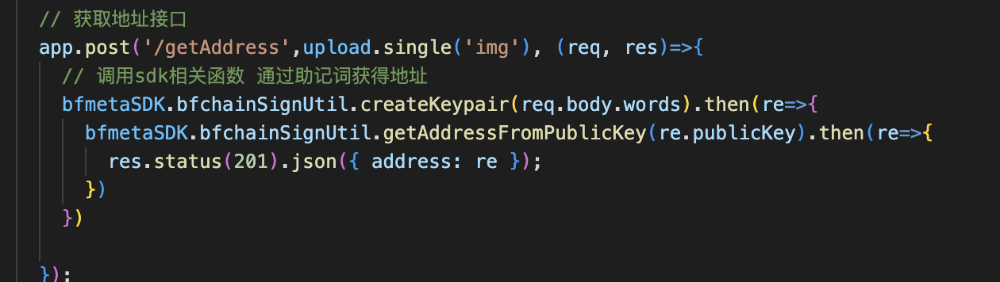
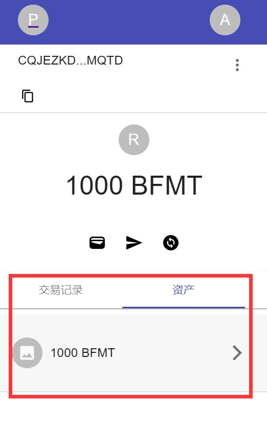
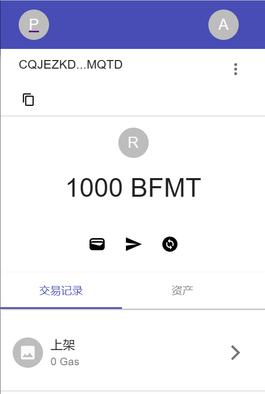
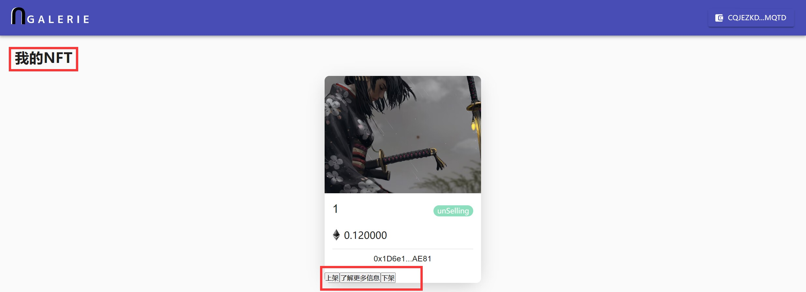

# BFM-SDK迁移步骤
#### 第三次修订
#### 版本号：0.1.3


## 1. SDK必要条件

  [SDK网址](https://www.npmjs.com/package/@bfmeta/node-sdk?activeTab=readme) 

  1. 安装node.js；

     [安装教程](https://blog.csdn.net/weixin_44893902/article/details/121788104?ops_request_misc=%257B%2522request%255Fid%2522%253A%2522167946199116800225564618%2522%252C%2522scm%2522%253A%252220140713.130102334..%2522%257D&request_id=167946199116800225564618&biz_id=0&utm_medium=distribute.pc_search_result.none-task-blog-2~all~top_positive~default-2-121788104-null-null.142^v75^control,201^v4^add_ask,239^v2^insert_chatgpt&utm_term=node.js%E5%AE%89%E8%A3%85&spm=1018.2226.3001.4187)

  2. 安装typescript;

     [安装教程](https://blog.csdn.net/m0_52043522/article/details/124781970?ops_request_misc=%257B%2522request%255Fid%2522%253A%2522167946666916782425149306%2522%252C%2522scm%2522%253A%252220140713.130102334..%2522%257D&request_id=167946666916782425149306&biz_id=0&utm_medium=distribute.pc_search_result.none-task-blog-2~all~top_click~default-2-124781970-null-null.142^v75^control,201^v4^add_ask,239^v2^insert_chatgpt&utm_term=typescript%E5%AE%89%E8%A3%85&spm=1018.2226.3001.4187)

     

## 2. 选定一个移植软件：

​    github上找开源代码，或者到[Dapp商场](https://dappradar.com/rankings)里面找代码。关键词：Dapp加应用类型，排除交易所，代币，钱包

以Dapp商场为例，确定一个移植软件：

1. 进入Dapp商场，选择公链



2. 选择关键词，确定需要移植的软件类型，如图选择Marketplaces，当然也可以选择其他类型，但注意移植的软件的关键词中不能包含交易所，钱包，代币：



3. 然后逐个查阅软件是否开源，先看Social行是否有github的logo，如果没有就点击Open dapp到Dapp内查看是否有开源网址。



注：确定软件，也可以到github上直接搜索Dapp + 关键词（如NFT，Game等）


## 3. 运行项目，确保项目能在原有环境中成功运行

1. 首先，确保你已经安装了所需的软件和工具，例如 Node.js、npm、Git、Truffle 等等。如果没有，请先安装。

2. 接下来，你需要从 GitHub 上下载项目代码。在命令行中输入以下命令：

   ```
   git clone <repository-url>
   ```

   其中 `<repository-url>` 是项目的 Git 仓库地址。

3. 下载完成后，进入项目目录并安装依赖（根据不同管理仓库不同命令方式来安装，以下是npm仓库）：

   ```
   cd <project-directory>
   npm install
   ```

4. 安装完成后，你可以使用以下命令启动前端和后端服务器（根据不同项目不同命令来启动，以下是js项目）：

   ```
   npm run start
   ```

5. 接下来，你需要启动区块链节点。如果你使用的是 Ganache 或 Truffle Develop 等本地开发环境，则可以直接启动。如果你使用的是公共测试网络（如 Ropsten、Kovan 等），则需要先获取测试币。

6. 最后，在命令行中输入以下命令来编译和部署智能合约：

   ```
   truffle compile
   truffle migrate
   ```

7. 如果一切顺利，你应该能够在浏览器中看到前端页面，并且能够通过区块链访问后端服务。

## 4. 了解接口代码

1. 浏览器接口文档

   [BFMeta API 接口文档](https://github.com/BioforestChain/developer.bfmeta.com/blob/main/zh/API%E5%8F%82%E8%80%83/PC%E5%85%A8%E8%8A%82%E7%82%B9/%E8%B0%83%E7%94%A8%E6%96%B9%E5%BC%8F%E4%BB%A5%E5%8F%8A%E7%A4%BA%E4%BE%8B/browserDoc.md)

2. BFmate-SDK接口文档：目前官网的开发者文档暂时无法使用，但可以通过官网的bfmate开发者文档了解接口作用和类型，然后去阅读BFmate-SDK源码，确定接口是否能替代原本智能合约，以及调用的接口参数的数量类型是否合适。

3. 示例参考迁移步骤6中后端代码，

## 5. 迁移思路(项目结构剖析)
本节通过对一个项目结构的剖析，分析每个项目的结构，并大致解析出迁移思路
我们选择迁移的示例项目是[Galerie](https://github.com/BravoNatalie/NFT-Marketplace),将项目从Github上克隆下来, 使用以下命令

```
git clone https://github.com/BravoNatalie/NFT-Marketplace.git
```

在Github上的介绍中可以看到，此项目使用JavaScript编写，是一个前端Web项目。
> Tips: 在项目选取上，尽量选择项目组熟悉的技术栈。如果项目组偏移动端开发可以选择Andriod及iOS项目进行迁移，如果项目组中前端成员较多，且对JavaScript较为了解，那么建议选择一个web项目来降低迁移的学习成本。后端可以是python，java或者js来调用sdk和相关业务的编写。

在VSCode中打开项目，可以看到如下所示的项目结构图：


从项目结构目录中可以清晰的看到项目分为后端（backend），客户端或前端（Client），智能合约部分（contracts），合约部署部分（migrations）。从项目的简介中见下图：


此项目采用React框架，后端使用了Express技术，使用Solidity做智能合约开发的语言进行架构。那么我们基于目前BFMetaSDK的特性，对原项目进行迁移，其实就是把原来使用智能合约运行在以太坊上的项目，迁移到BFChain上去。对应项目中，前端调用智能合约的代码块或者语句替换成调用后端的接口（该后端接口再去调用BFMetaSDK对应的接口，也可以根据业务进行调整)，后端调用智能合约的代码块或者语句则直接替换成调用BFMetaSDK对应的接口（根据业务进行调整)，见下图：


如上图所述，因为我们的BFMetaSDK封装了相应的底层逻辑，使得原来需要与链做交互的逻辑更加抽象，也使得业务方的调用更加便捷，不再需要通过智能合约与各个链进行交互，所以我们只需要把相关的后端调用的存储逻辑进行相应的替换，即原先通过智能合约与链做交互的部分。
每个项目的架构不尽相同，但是大体思路是一致的，就是替换掉原有底层的链。你可以把底层的链想成一个数据库，那么智能合约就是一些SQL语句。我们现在的BFMeta已经封装好了业务功能性的API，我们现在做的工作就是把原来后端通过SQL语句与数据库做交互的部分换成SDK中的API，来实现原有的功能。其实就是底层换了数据库，新的数据库的调用方式更叫抽象高级，不必使用SQL语句（智能合约)。

## 6. 找对应调用智能合约的函数，修改成调用后端SDK对应接口

1. 例如前端market中调用智能合约计算NFT数量（ totalSupply( ) ):



2. 改为在前端用函数调用后端接口：

   

3. 然后在后端调用BFmate接口（业务上也可能存于数据库），参考迁移步骤7

注：需要根据实际业务，及时调整代码。


## 7. BFMetaSDK在后端运行，前端通过http请求后端接口，后端接口再调用对应功能的SDK接口获取数据，返回给前端

   以通过助记词登录返回地址为例

   前端：



   后端：



## 8.增加适配BFchain的功能

以我们选择迁移的示例项目是Galerie为例，该项目原先以ETH为底层，钱包连接的是以太坊。

以登录钱包获取个人信息为例

我们需要实现以下界面，通过调用BFMetaSDK以获取链上数据与NFT相关买卖操作

<center class="half">
    
    
</center>

除此之外，我们对于上架的NFT数据需要保存到链上，同时要对商品进行管理



此处我们需要调用到BFMetaSDK以保存商品相关数据至链上

#### 插入代码

## 9. 可能遇到的问题

   错误1：node版本过高，不兼容。

  解决方法：命令行输入

```
set NODE_OPTIONS=--openssl-legacy-provider
```

错误2：SDK运行环境错误

解决方法：SDK只能运行在node上

错误3：TS已装，但依然显示缺少TS

解决方法：npm卸载ts包，重新安装

